# LanDisk 使用入门

手机、平板和电脑在同一个 WiFi 下就能互传文件，不用数据线，不用登录，也不用装 App。

本手册带你走完第一次传文件的完整过程，大概五分钟。

## 1. 安装与启动

装上 LanDisk，打开。电脑上会出现主界面，服务在后台自动跑起来。

> 第一次启动 Windows 防火墙会弹窗，选「允许访问」，不然手机连不上。

## 2. 添加共享目录

LanDisk 能传的是你电脑上的文件夹。手机想访问哪个文件夹，得先把它「共享」出来。

还没有共享目录时，主界面会提示「请先添加共享目录」。有两种添加方式。

**在设置里添加**

1. 点右上角「设置」
2. 在「共享目录」栏输入文件夹的绝对路径（比如 `D:\share`），名称会自动取文件夹名
3. 点「添加」

路径不知道在哪找？在文件资源管理器里打开那个文件夹，点地址栏复制路径，粘进来就行。

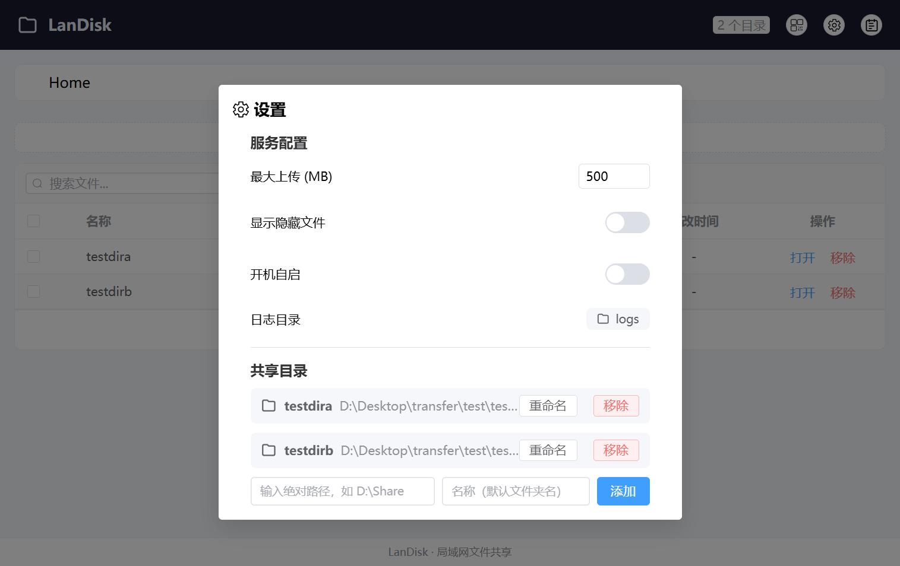

**直接把文件夹拖进来**（桌面应用）

把要共享的文件夹拖到主界面，出现全屏提示后松手，就加好了。

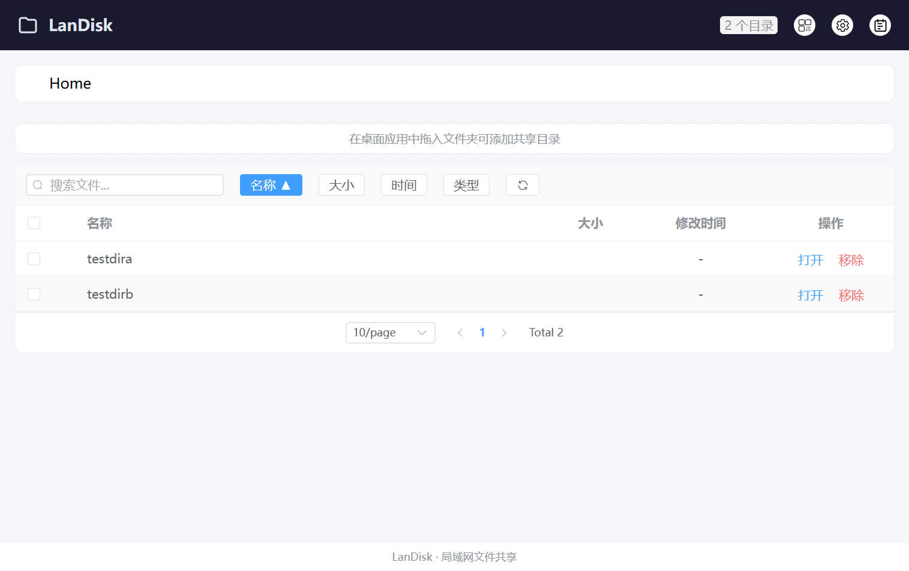

共享目录可以加很多个。想改名字或取消共享，随时回「设置」里操作。注意「移除」只是取消共享，不会动磁盘上的文件。

## 3. 浏览文件

点一个共享目录进去，就是文件列表。

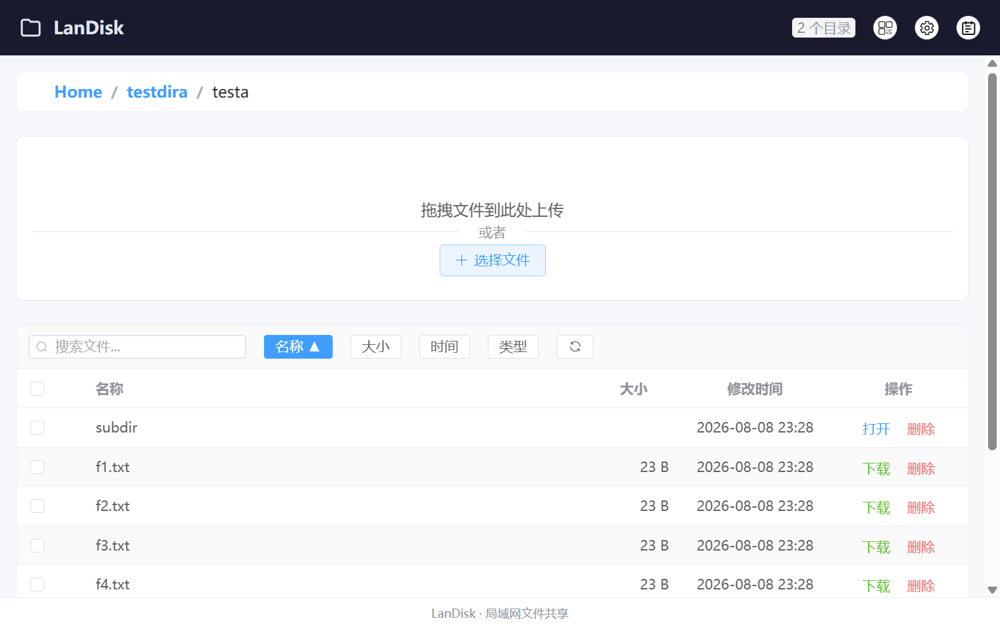

- 点**文件名**打开文件（桌面应用）或下载（浏览器）；点文件夹的文件名进入子目录
- 用列表上方的面包屑回上一层，想跳几层点几层

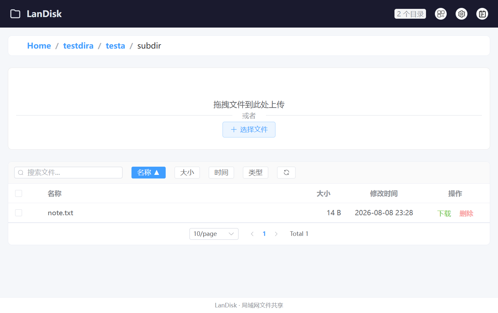

搜索框按名字过滤文件。列可以按名称、大小、时间、类型排序，每页 5 / 10 / 20 / 50 条自选。

## 4. 传文件

### 上传到电脑

把文件从桌面或文件夹拖到 LanDisk 窗口任意位置，出现全屏提示就松手。

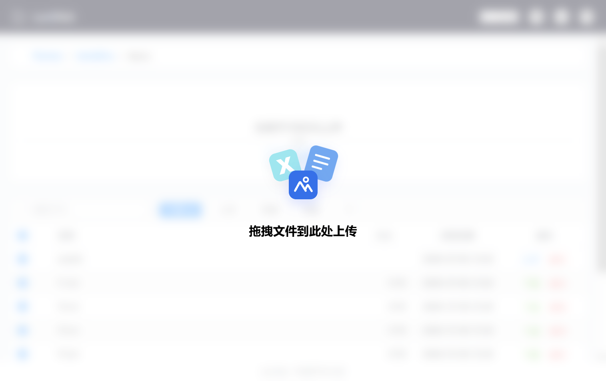

要是有重名文件，会弹窗让你选怎么处理：

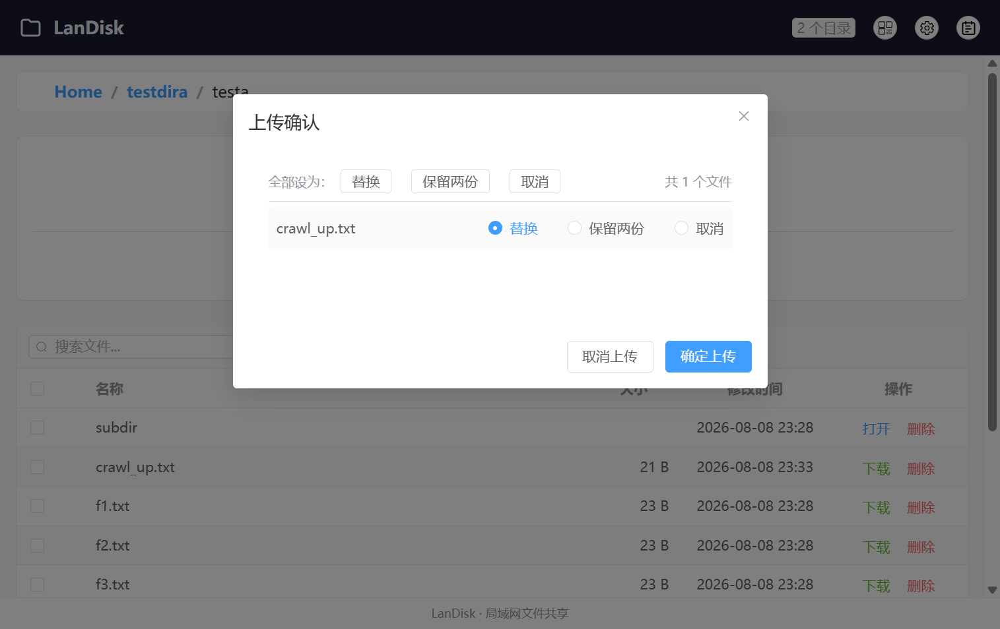

| 选项 | 效果 |
|---|---|
| 替换 | 覆盖原文件 |
| 保留两份 | 新文件加个序号，如 `file (1).pdf` |
| 取消 | 跳过这个文件 |

> 在共享目录里拖入文件是上传；在虚拟根目录拖入文件夹是添加共享目录。

### 手机 / 平板访问电脑

1. 点电脑右上角「扫码访问」，弹窗里显示地址和二维码
2. 手机或平板用浏览器打开地址，或者直接扫二维码（弹窗里也可以点「复制链接」）
3. 进共享目录就能看到文件

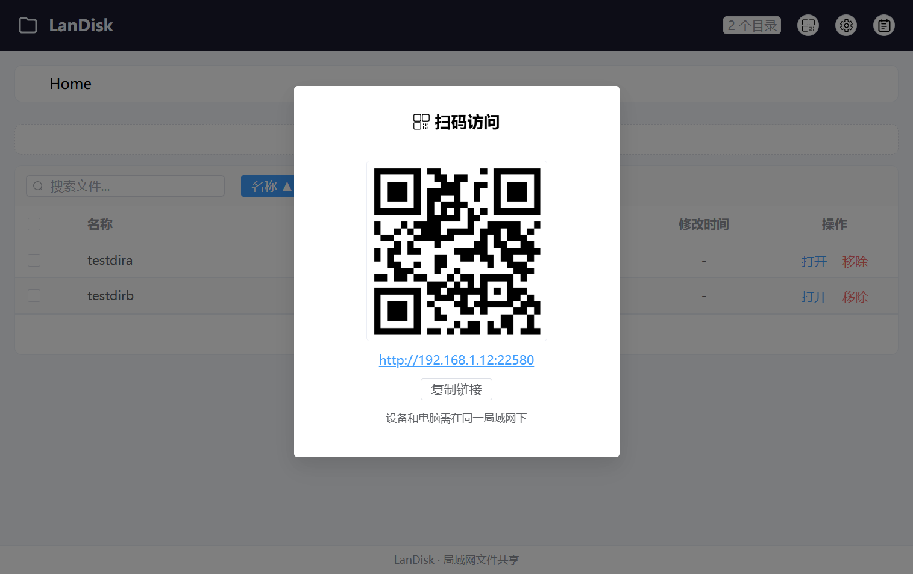

手机上文件以卡片形式展示，点文件名可以下载或进入目录；行末的图标按钮分别是进入目录、下载、删除：

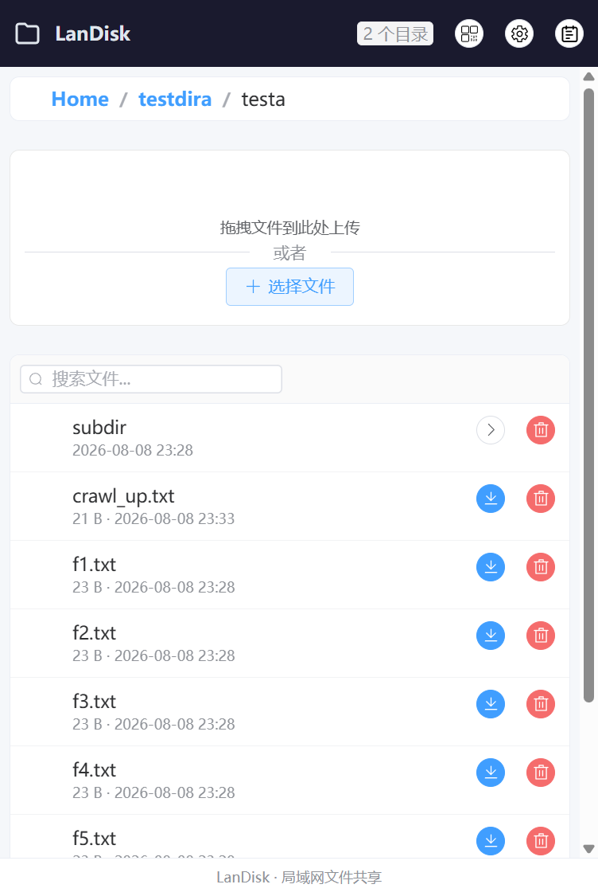

- 下载到手机：点文件名，或点行末的下载图标
- 传到电脑：进共享目录后点「选择文件」，把手机里的文件传上来

> 桌面应用里文件行的按钮是「打开」，用系统默认程序打开；浏览器里是「下载」。

## 5. 其他常用功能

### 批量操作

勾选多个文件，顶部会出现批量操作栏：

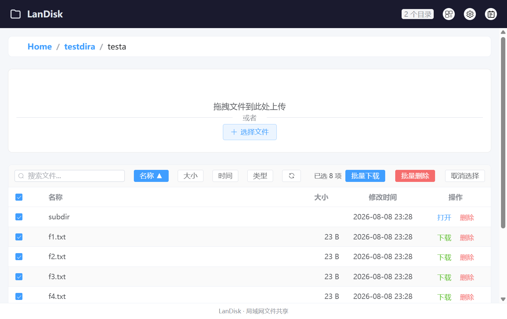

浏览器里能批量下载，勾选后逐个下载；批量删除确认后执行，带进度条。不想要了，点「取消选择」退出批量模式。

### 删除文件

删除的文件先进系统回收站，随时能还原。回收站不可用的时候才会直接删掉。

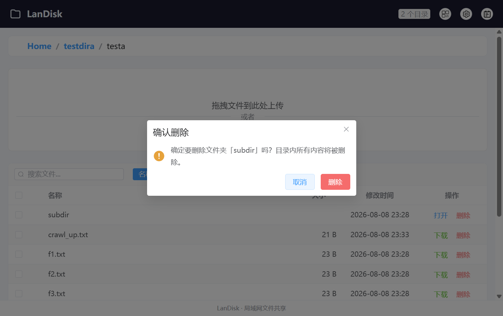

### 查看日志

点右上角「服务器日志」打开日志查看器，上传、删除、下载这些操作都会记在这里。新日志自动刷新，能按等级过滤，也能搜文字。

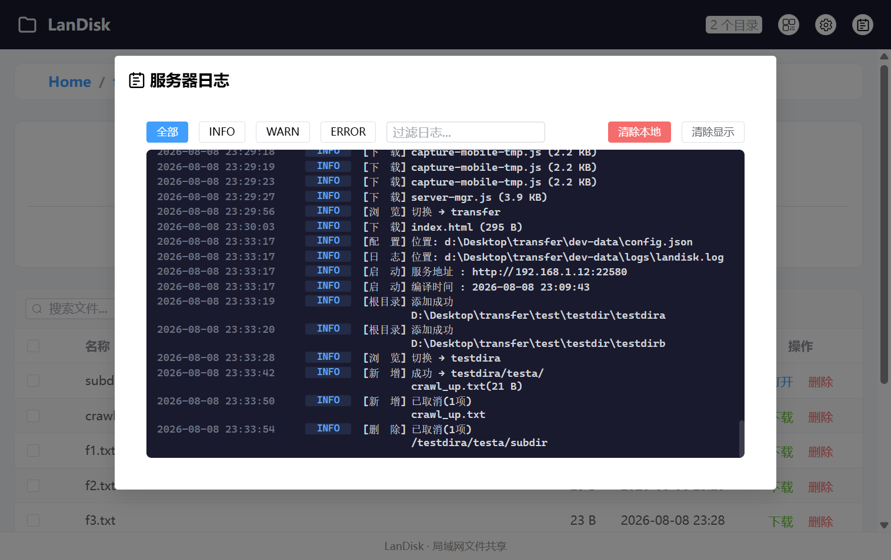

## 6. 常用设置

| 设置 | 说明 |
|---|---|
| 最大上传 | 单文件大小上限（MB），默认 500 |
| 显示隐藏文件 | 是否显示隐藏文件和系统文件 |
| 开机自启 | 开机自动运行（仅桌面应用） |
| 日志目录 | 桌面应用内点一下，可在资源管理器打开日志文件夹 |

## 常见问题

**手机或平板打不开页面？**
检查设备和电脑是不是在同一个局域网，防火墙有没有允许 LanDisk 访问网络。

**传大文件失败？**
看设置里的「最大上传」，默认 500 MB。

**添加共享目录提示已存在？**
同一文件夹不会重复加（盘符大小写不影响，`C:` 和 `c:` 是一回事）。要是提示「根目录名称已存在」，是名字撞了，换个名。
