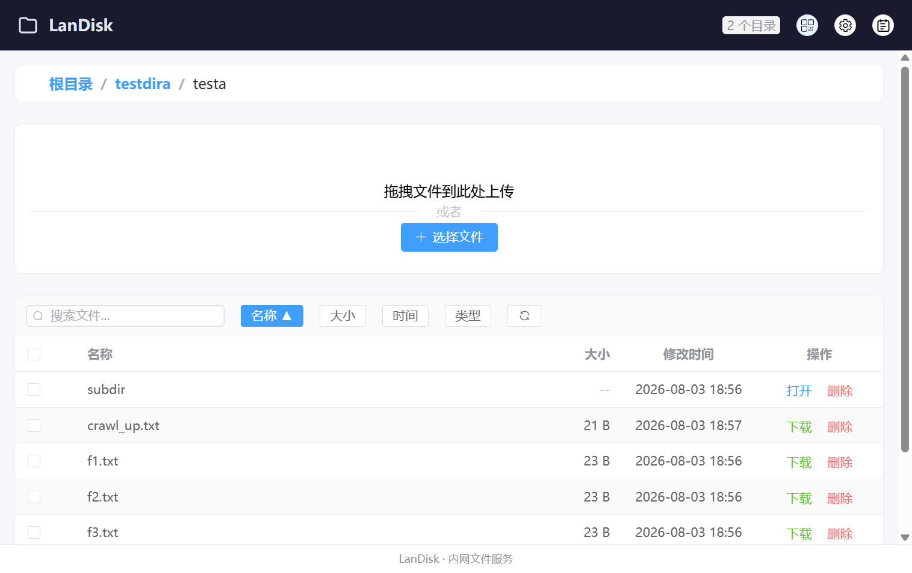
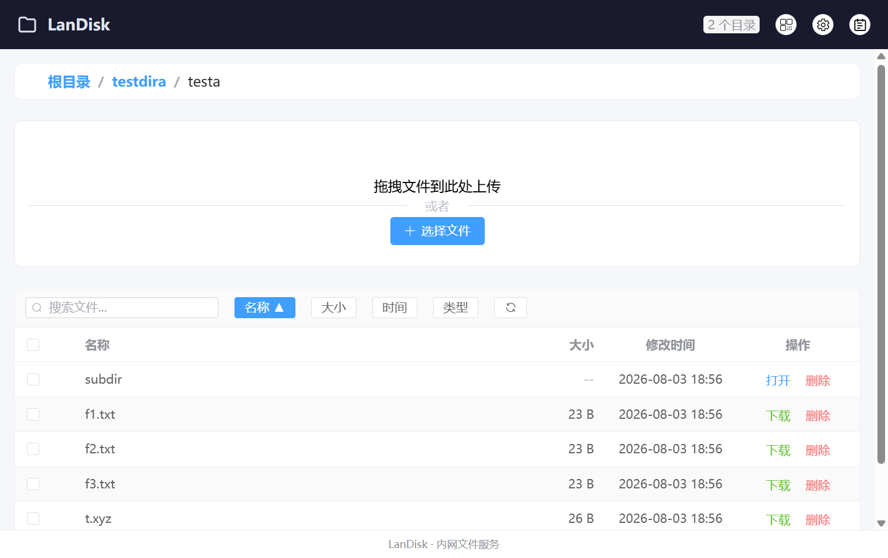
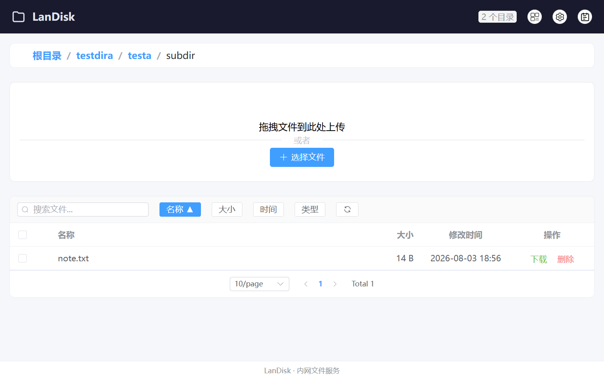
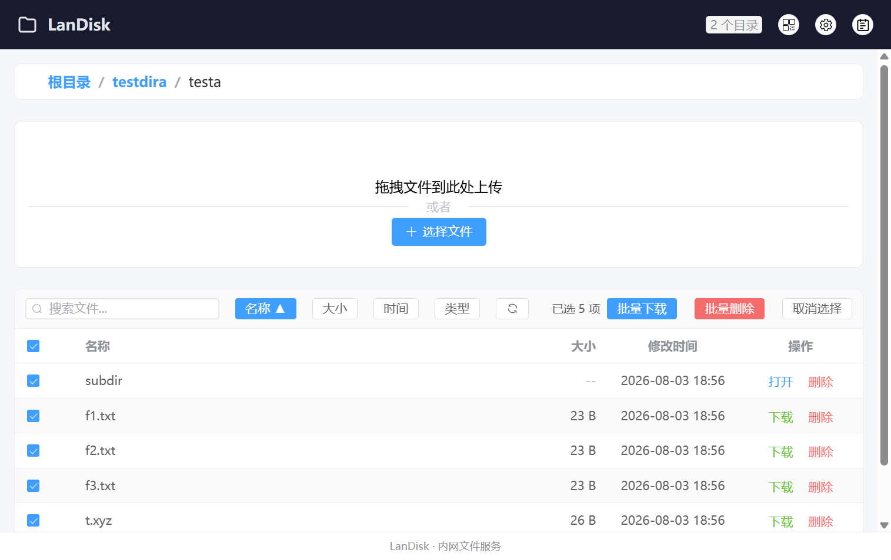
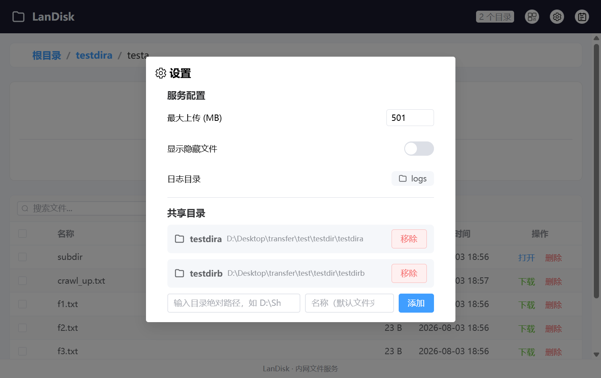
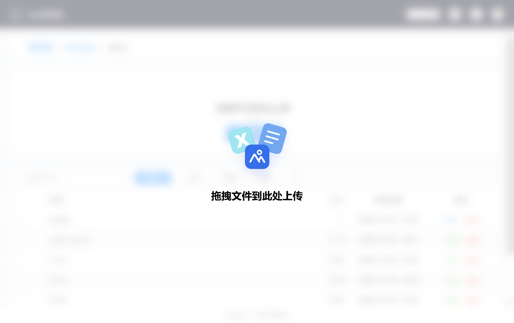
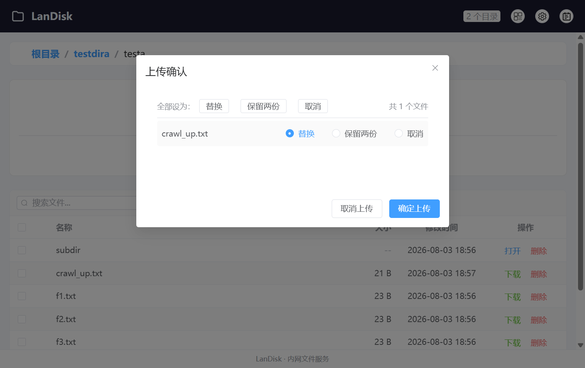
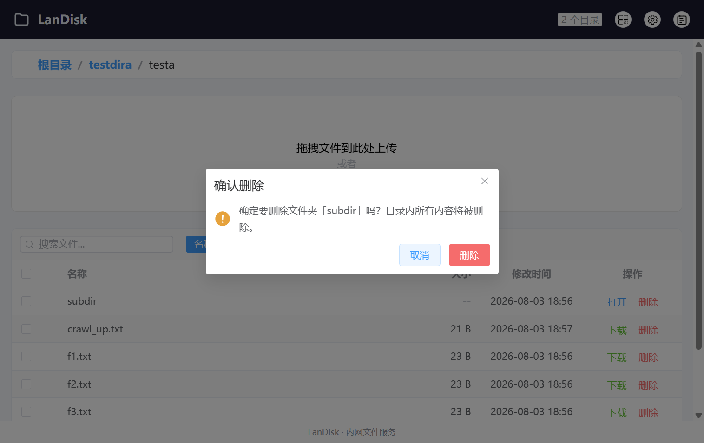
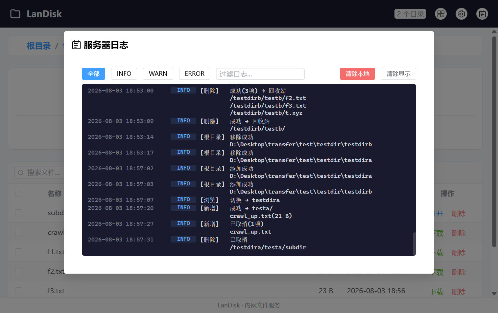

# LanDisk 用户手册

局域网文件快传工具 — 电脑手机在同一局域网下，扫码即连，无需数据线、无需登录、无需安装 App。

---

## 启动与访问

启动 LanDisk 后，服务自动运行在 `http://localhost:22580`。手机（移动端）点击电脑界面右上角 📱 弹出的二维码扫码，或直接访问电脑的局域网 IP 地址即可打开。



手机和电脑需在同一局域网下。首次启动 Windows 防火墙会弹窗，**必须允许 LanDisk 服务（landisk-server）** 访问网络。

---

## 文件浏览

主界面展示当前目录的文件列表，支持虚拟根目录、面包屑导航、搜索、排序和分页。无共享目录时显示引导提示「请先添加共享目录」。



### 虚拟根目录

打开应用先看到**虚拟根目录**，列出所有共享目录（按设置的名称显示）。点击任一目录进入浏览，无需手动切换根目录。每个共享目录行有「打开」和「移除」按钮（**移除 = 仅取消共享，不删除磁盘上的文件**）。虚拟根目录下拖入文件夹可直接添加为共享目录（仅桌面壳，浏览器会提示去设置中添加）。


### 面包屑导航

当前路径以面包屑形式显示在文件列表上方，点击任意层级可快速跳转。点击「根目录」回到当前根的最顶层。



### 多选批量操作

勾选多个文件后，顶部工具栏显示批量操作栏，支持批量下载和批量删除。再次点击「取消选择」退出批量模式。



### 功能说明

| 功能 | 说明 |
|---|---|
| **目录导航** | 点击文件夹进入子目录，面包屑导航可回退 |
| **文件搜索** | 顶部搜索框按文件名过滤 |
| **排序** | 按名称 / 大小 / 时间 / 类型（后缀）排序 |
| **分页** | 每页 5 / 10 / 20 / 50 条 |
| **图标** | 70+ 种文件图标，彩色分类 |

### 操作

| 操作 | 方法 |
|---|---|
| **进入目录** | 单击文件夹行（或双击） |
| **打开文件** | 桌面壳内点击行内「打开」按钮或单击行，用系统默认程序打开；浏览器内点击行或「下载」按钮为下载 |
| **打开文件夹** | 桌面壳内点文件夹行「打开」→ 用 Windows 资源管理器打开该文件夹（仅壳，浏览器内为进入目录） |
| **下载文件** | 点击行内「下载」按钮（浏览器端） |
| **移除共享目录** | 虚拟根下点共享目录行「移除」→ 确认，仅取消共享不删磁盘文件 |
| **删除文件** | 真实目录内点击行内「删除」按钮，移入回收站 |
| **批量下载** | 勾选多个文件 → 点「批量下载」（仅浏览器） |
| **批量删除** | 真实目录内勾选 → 点「批量删除」 → 确认 |
| **批量移除** | 虚拟根下勾选多个共享目录 → 点「批量移除」 → 确认 |

---

## 设置



右上角 ⚙ 打开设置：

- **最大上传**：单文件大小上限（MB），点击数值可修改
- **显示隐藏文件**：是否在文件列表中显示隐藏文件和系统文件
- **开机自启**（桌面壳）：开关系统启动时自动运行
- **日志目录**：显示日志文件夹名称，本机点击可在资源管理器中打开该文件夹
- **共享目录**：添加/移除文件服务根目录，支持多个根目录。添加时输入绝对路径（可选自定义名称，默认取文件夹名，名称须唯一），点击「移除」删除。

修改配置后自动持久化到 `config.json`（默认与程序同目录，见下方「配置」）。

---

## 上传文件

### 全局拖拽上传

将文件从桌面或文件夹拖拽到窗口任意位置，出现毛玻璃全屏提示即可松手上传。



> **拖拽分两种**：在共享目录内拖入文件 = 上传；在**虚拟根目录**拖入文件夹 = 添加共享目录（仅桌面壳，浏览器里拖入会提示去设置中添加）。

### 冲突处理

上传同名文件时弹窗逐项处理：



| 选项 | 效果 |
|---|---|
| **替换** | 覆盖原文件 |
| **保留两份** | 新文件自动加序号（如 `file (1).pdf`）|
| **取消** | 跳过该文件 |

支持「全部替换」/「全部保留」批量操作。

---

## 下载

> 下载面向浏览器访问（手机/其他设备，或本机用浏览器打开）。仅在桌面壳（Tauri）内，文件操作按钮显示为「打开」— 用系统默认程序打开文件，不触发下载；浏览器（任何设备）始终显示「下载」。

### 单文件下载

点击文件行末的「下载」按钮，浏览器在新标签页下载。

### 批量下载

勾选多个文件 → 点「批量下载」，每个文件依次在新标签页中下载。桌面壳不显示此按钮。

---

## 删除

> **区分「删除」与「移除」**：共享目录内点「删除」会真的把文件/文件夹移入回收站（或永久删除）；虚拟根下对共享目录是「移除」，**只取消共享、不碰磁盘文件**。删除共享根目录被后端拦截（提示"请用移除"）。

### 回收站优先

删除操作默认调用系统回收站（PowerShell COM 方法），文件可还原。

### 永久删除

回收站不可用时自动回退到永久删除（`remove_file` / `remove_dir_all`），日志中会记录具体去向。

### 批量删除

勾选多个文件 → 点「批量删除」，弹出确认框，确认后并行执行，显示百分比进度条。完成后记录每条的实际去向（回收站 / 永久删除）。



---

## 日志查看器



右上角 📖 打开日志查看器。日志由服务端实时推送（SSE），无需手动刷新。

### 功能

| 功能 | 说明 |
|---|---|
| **SSE 实时推送** | 新日志即时显示，无需轮询 |
| **粘性底部** | 新日志自动滚动到底部；不在底部时显示「回到底部」按钮 |
| **等级过滤** | 全部 / INFO / WARN / ERROR |
| **文本搜索** | 过滤包含指定文本的日志条目 |
| **清除显示** | 仅清除当前查看列表，不影响服务端 |
| **清除本地** | 清空服务端环形缓冲区 + 日志文件 |

### 日志格式

日志以结构化 JSON 存储，查看器渲染为 `时间 等级 [操作] 描述(N项) → 去向`，涉及的文件逐行显示，数量用 `(N项)` 表示（如「成功(5项) → 回收站」）。

### 服务重启后历史

环形缓冲区上限 200 条，重启后自动从日志文件加载最后 100 条历史，日志查看器不会空白。

---

## 系统托盘

| 操作 | 效果 |
|---|---|
| 关闭窗口 | 隐藏到托盘，后台继续运行 |
| 双击托盘图标 | 显示窗口 |
| 右键托盘 → 退出 | 完全退出服务 |

单实例运行，多点图标不会重复启动。开机自启在设置弹窗中开启（仅桌面壳）。

---

## 配置

配置文件 `config.json`，**默认与程序（landisk-server.exe）在同一目录**（开发调试时可用 `LANDISK_DATA_DIR` 环境变量指定数据目录，如 `dev-data/`）：

```json
{
  "roots": [{ "name": "test", "path": "D:\\Desktop\\test" }],
  "port": 22580,
  "max_file_size_mb": 500,
  "show_hidden_files": false
}
```

也可通过界面 ⚙ 管理配置和共享目录。

---

## 端口冲突

修改 `config.json` 中的 `port` 字段后重启服务。

---

## 常见问题

**Q: 手机访问提示「无法连接」？**
A: 检查手机和电脑是否在同一局域网，防火墙是否允许 LanDisk 服务（landisk-server）访问网络。

**Q: 上传大文件失败？**
A: 检查设置中的「最大上传」限制，默认 500 MB。

**Q: 安装目录是 Program Files，配置能保存吗？**
A: 配置和数据默认存于程序所在目录。若安装在只读目录（如 Program Files）导致无法写入，可设置 `LANDISK_DATA_DIR` 环境变量指向可写目录（如 `D:\LanDiskData`），或改用允许写入的安装路径。

**Q: 日志文件会越来越大吗？**
A: 单个日志文件超过 1 MB 自动轮转归档。旧文件不会自动删除，可手动清理程序目录下的 `logs/` 文件夹。

**Q: 添加共享目录后提示已存在？**
A: Windows 盘符大小写不影响（`C:` / `c:`、`D:` / `d:` 等同盘），系统会用 `dunce::canonicalize` 把路径统一成磁盘实际大小写，不会重复添加。若提示「根目录名称已存在」，是因为名称重复，换个名称即可。
