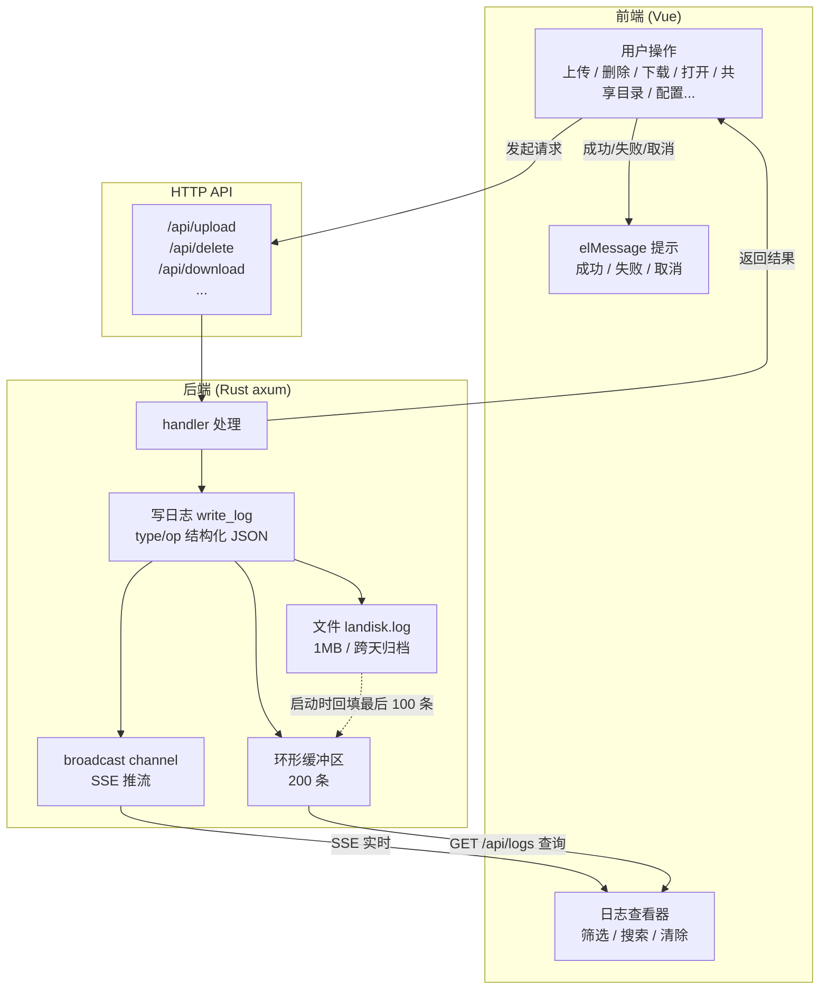

# LanDisk

局域网文件快传 — 电脑、手机、平板在同一局域网下，扫码即连，拖拽传文件。

无需数据线、无需登录、无需安装 App。

## 功能

- 文件浏览、虚拟根目录（所有共享目录平铺展示）、面包屑导航
- 虚拟根拖入文件夹直接添加共享目录（桌面应用），行内「移除」取消共享不删磁盘文件
- 全局拖拽：目录内拖文件上传、虚拟根拖文件夹添加共享，毛玻璃全屏提示
- 冲突弹窗：同名文件可选替换 / 保留两份 / 取消，支持批量统一操作
- 文件列表刷新时逐格 shimmer 加载效果
- 删除进回收站 / 永久删除（回收站不可用时自动 fallback）
- 批量删除：多选 + 并行执行 + 百分比进度条
- 批量下载：多选 + 逐项浏览器下载
- 搜索：文件名过滤
- 排序：名称 / 大小 / 时间 / 类型
- 分页：5 / 10 / 20 / 50 条
- 70+ 种文件图标，彩色分类
- 界面内嵌二维码，手机或平板扫码即连
- 内置日志查看器：SSE 实时推送、等级过滤、文本搜索、清除、结构化 JSON
- 系统托盘，关闭窗口后台运行
- 开机自启（静默托盘）
- 单实例，多点图标不重复启动
- 界面管理共享目录，持久化到 `config.json`
- 点击文件可用系统默认程序打开；壳内点文件夹「打开」用 Windows 资源管理器打开
- 中文文件名上传不乱码
- 无共享目录时智能提示引导添加

## 安装使用

当前版本：**v0.1.2**

1. 运行 `LanDisk_*_x64-setup.exe`（从 [`dist/`](dist/) 获取）
2. 右上角 ⚙ 添加共享目录
3. 点 📱 获取二维码，手机或平板扫码访问

| 操作 | 效果 |
|---|---|
| 关闭窗口 | 隐藏到托盘 |
| 双击托盘 | 显示窗口 |
| 右键托盘 → 退出 | 完全退出 |

## 架构

```
┌──────────────────────────────────────┐
│  Tauri WebView ──▶ localhost:22580 ──┤
│  移动设备浏览器 ──▶ 192.168.1.x:22580 ─┤
│                                        │
│  Rust axum 后端 (sidecar) 同时提供：     │
│   ├─ 前端页面 (client/dist)            │
│   └─ API (/api/*)                     │
└───────────────────────────────────────┘
```

PC、手机和平板访问的是同一个服务。

### 日志流转

每次操作（上传 / 删除 / 下载 / 打开 / 共享目录 / 配置…）由前端发请求、后端 handler 处理后写入一条**结构化日志**，日志同时流向内存缓冲、文件和实时推流三个去处：



- 日志**格式与 type/op 完整码表**见 [LOG_FORMAT.md](LOG_FORMAT.md)
- 服务启动时自动从 `landisk.log` 末尾解析最后 **100 条** JSON 条目补入缓冲池，避免重启后日志查看器空白
- 日志文件写入 `<数据目录>/logs/landisk.log`，超过 1 MB 或跨天时归档为 `landisk-{date}.log`

## 配置

数据目录优先级：`LANDISK_DATA_DIR` 环境变量（dev/test 指向 `dev-data/`）→ 否则为程序（landisk-server.exe）所在目录。`config.json` 存于数据目录下，首次运行自动创建：

```json
{
  "roots": [{ "name": "Desktop", "path": "D:/Desktop" }],
  "port": 22580,
  "max_file_size_mb": 500,
  "show_hidden_files": false
}
```

共享目录也可通过界面 ⚙ 增删，自动持久化到 `config.json`。

## 注意事项

- 设备需在同一局域网
- 首次启动 Windows 防火墙会弹窗，**必须允许 LanDisk 服务访问网络**
- 端口 `22580`

## 开发

```bash
npm install && cd client && npm install
```

| 命令 | 说明 |
|---|---|
| `npm start` | Tauri 桌面开发模式 |
| `start-dev.bat` | 一键调试（杀旧进程 → 构建前端 → Tauri + Vite） |
| `npm run server` | Rust 后端直启 (:22580) |
| `npm run dev` | cargo watch 自动重编译 |

### 构建

```bash
npm run build:tauri   # 一键构建安装包
```

产物：`dist/LanDisk_0.1.2_x64-setup.exe`

### 测试

```bash
node test/setup.js            # 创建测试数据
node test/test-api.js         # API 测试（87 项）
node test/setup.js            # 重建测试数据
node -r ./test/cdp-wrapper.js test/test-crawl.js   # 爬虫测试（63 项）
node -r ./test/cdp-wrapper.js test/capture-screens.js  # 生成文档截图到 images/
```

API 和爬虫测试**自动管理后端服务**（开始自动杀旧起新、结束自动关闭），无需手动 `npm run server`。测试前需先构建前端（`npm run build:server`）保证 `client/dist` 是最新。

> 完整测试计划、双维度验证原则与测试项明细见 [TESTPLAN.md](TESTPLAN.md)。

## 项目结构

```
├── client/              # Vue 前端
│   └── src/
│       ├── api/         # 请求层
│       ├── components/  # FileTable, UploadZone, LogViewer, SettingsDialog
│       ├── utils/       # format.js (图标/大小/日期), logFormat.js (日志解析)
│       └── views/       # FileBrowser.vue
├── src-tauri/           # Tauri + Rust 后端
│   ├── src/
│   │   └── lib.rs       # 窗口/托盘/sidecar 管理
│   └── server/src/
│       ├── main.rs      # axum 路由 + 所有 handler
│       ├── config.rs    # 配置加载
│       ├── logger/      # 环形缓冲区 + 文件轮转 + SSE
│       └── middleware/  # 路径穿越防护
├── scripts/
│   ├── build-sidecar.js # 编译 Rust 后端 sidecar
│   └── copy-installer.js# 复制安装包到 dist/
├── dev-data/            # 开发调试数据目录（LANDISK_DATA_DIR）
└── start-dev.bat        # 调试启动
```

## 技术栈

| 层 | 技术 |
|---|---|
| 桌面应用 | Tauri 2 (Rust) — 窗口/托盘/单实例锁/开机自启 |
| 后端 | axum (Rust) |
| 前端 | Vue 3 + Vite + Element Plus |
| 打包 | NSIS |
