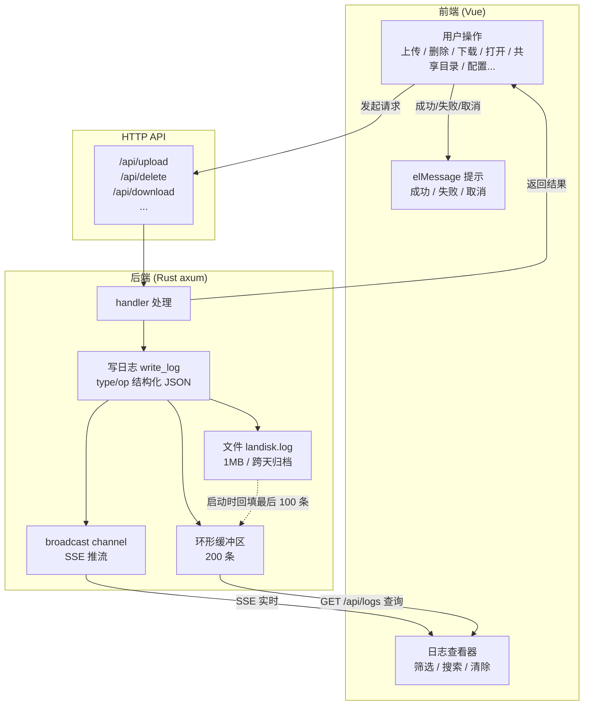

<div align="center">


# LanDisk

局域网文件快传 — 桌面端装一个应用，手机/平板扫码即连，在电脑和移动设备之间拖拽传文件。

</div>

完整的新手使用教程见 [Landisk.md](Landisk.md)（从零开始，图文并茂，约五分钟上手）。

## 功能

- 添加共享目录有两种方式：设置里输入路径，或直接把文件夹拖进主界面
- 拖文件进目录 = 上传；拖文件夹进虚拟根 = 添加共享
- 同名文件可替换 / 保留两份 / 取消，支持批量统一操作
- 手机或平板扫码即连，能下载文件，也能把手机文件传回电脑
- 文件搜索、排序（名称/大小/时间/类型）、分页
- 删除进回收站可还原；批量操作带进度条
- 70+ 种文件图标，彩色分类
- 内置日志查看器，实时更新，可过滤和搜索
- 系统托盘，关闭窗口后台运行
- 开机自启、单实例运行

## 快速开始

1. 运行 `LanDisk_*_x64-setup.exe` 安装（从 [`dist/`](dist/) 获取）
2. 打开应用，添加共享目录（设置里输入路径，或直接把文件夹拖进主界面）
3. 手机或平板点右上角「扫码访问」，扫二维码即连

> [!TIP]
> 第一次启动 Windows 防火墙会弹窗，选「允许访问」，否则其他设备连不上。

## 文档

| 文档 | 作用 |
|---|---|
| [Landisk.md](Landisk.md) | **用户手册** — 从零开始的图文使用教程（新手看这个） |
| [CLAUDE.md](CLAUDE.md) | **开发工作手册** — 给 AI/协作者：改代码的约定、命令、坑 |
| [LOG_FORMAT.md](LOG_FORMAT.md) | **日志格式** — 结构化日志的 type/op 完整码表 |
| [TESTPLAN.md](TESTPLAN.md) | **测试计划** — 测试原则、用例明细、运行方式 |

## 脚本

**开发启动**

| 脚本 | 作用 |
|---|---|
| `start-dev.bat` | 一键调试：杀旧进程 → 启动 Vite 热更新 + Tauri 壳 |

**构建**

| 脚本 | 作用 |
|---|---|
| `scripts/build-sidecar.js` | 编译 Rust 后端为 sidecar（`binaries/landisk-server.exe`） |
| `scripts/copy-installer.js` | 把生成的安装包复制到 `dist/` 并清理临时产物 |
| `scripts/set-version.js` | 一键同步项目版本号到全部 8 个位置（用法：`node scripts/set-version.js 0.1.3`） |

**测试**（位于 `test/`）

| 脚本 | 作用 |
|---|---|
| `test/setup.js` | 创建测试目录结构（每个测试运行前必须先执行） |
| `test/verify.js` | 文件系统验证工具（断言用） |
| `test/verify-clean.js` | 测试后清理 testdir/ + 检查配置残留 |
| `test/server-mgr.js` | 测试用服务管理：自动构建前端 → 杀旧 → 起新 → 就绪 → 停止 |
| `test/test-api.js` | API 功能测试（87 项） |
| `test/test-crawl.js` | 爬虫功能测试（63 项），CDP 真实鼠标操作，双模式（网页端/桌面应用） |
| `test/capture-screens.js` | 用 CDP 截图文档用图到 `images/` |
| `test/cdp-wrapper.js` | CDP 辅助：注入 `nav` / `safe` / `cdpRaw` 等全局函数 |

## 架构

一个 Rust 后端同时服务桌面端和移动端浏览器：

```
┌──────────────────────────────────────┐
│  Tauri WebView ──▶ localhost:22580 ──┤
│  移动设备浏览器 ──▶ 192.168.1.x:22580 ─┤
│                                        │
│  Rust axum 后端 (sidecar) 同时提供：     │
│   ├─ 前端页面 (client/dist)            │
│   └─ API (/api/*)                     │
└───────────────────────────────────────┘
```

### 日志流转

每次操作（上传 / 删除 / 下载 / 打开 / 共享目录 / 配置）由前端发请求、后端处理，写入一条结构化日志，同时流向内存缓冲、文件和实时推流：



日志格式与完整 type/op 码表见 [LOG_FORMAT.md](LOG_FORMAT.md)。

## 配置

配置文件 `config.json` 存于数据目录下（默认与程序同目录，可用 `LANDISK_DATA_DIR` 环境变量指定）：

```json
{
  "roots": [{ "name": "Desktop", "path": "D:/Desktop" }],
  "port": 22580,
  "max_file_size_mb": 500,
  "show_hidden_files": false
}
```

多数配置可直接通过界面「设置」修改，自动持久化。

## 开发

```bash
npm install && cd client && npm install
```

| 命令 | 说明 |
|---|---|
| `npm start` | Tauri 桌面开发模式 |
| `start-dev.bat` | 一键调试（杀旧进程 → Vite + Tauri） |
| `npm run server` | 后端直启 (:22580)，服务前端静态文件 |
| `npm run dev` | cargo watch 后端热重载 |

### 构建

```bash
npm run build:tauri   # 构建前端 + 编译 sidecar + 打包安装包
```

产物：`dist/LanDisk_0.1.2_x64-setup.exe`

### 测试

```bash
node test/setup.js            # 创建测试数据
node test/test-api.js         # API 测试（87 项）
node test/setup.js            # 重建测试数据
node -r ./test/cdp-wrapper.js test/test-crawl.js   # 爬虫测试（63 项）
```

> [!NOTE]
> API 和爬虫测试自动管理后端服务（开始自动杀旧起新、结束自动关闭），无需手动 `npm run server`。完整测试计划见 [TESTPLAN.md](TESTPLAN.md)。

## 项目结构

```
├── client/              # Vue 前端
│   └── src/
│       ├── api/         # 请求层
│       ├── components/  # FileTable, UploadZone, LogViewer, SettingsDialog
│       ├── utils/       # format.js (图标/大小/日期), logFormat.js (日志解析)
│       └── views/       # FileBrowser.vue
├── src-tauri/           # Tauri 壳 + Rust 后端
│   ├── src/
│   │   └── lib.rs       # 窗口/托盘/sidecar 管理
│   └── server/src/
│       ├── main.rs      # axum 路由 + 所有 handler
│       ├── config.rs    # 配置加载
│       ├── logger/      # 环形缓冲区 + 文件轮转 + SSE
│       └── middleware/  # 路径穿越防护
├── scripts/
│   ├── build-sidecar.js # 编译 Rust 后端 sidecar
│   └── copy-installer.js# 复制安装包到 dist/
├── dev-data/            # 开发调试数据目录（LANDISK_DATA_DIR）
└── start-dev.bat        # 调试启动
```

## 技术栈

| 层 | 技术 |
|---|---|
| 桌面应用 | Tauri 2 (Rust) — 窗口/托盘/单实例锁/开机自启 |
| 后端 | axum (Rust) |
| 前端 | Vue 3 + Vite + Element Plus |
| 打包 | NSIS |
